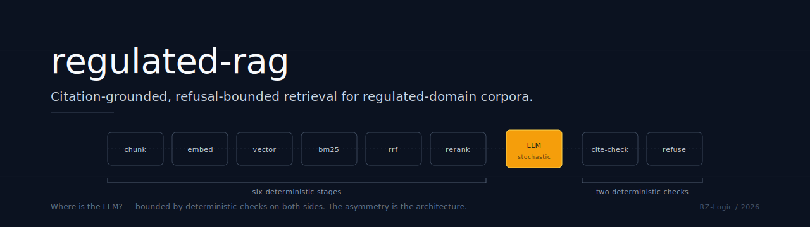

<p align="center">
  
</p>

<h1 align="center">regulated-rag</h1>

<p align="center">
  <strong>Citation grounding belongs in code, not in prompts.<br/>So does refusal.</strong>
</p>

<p align="center">
  <a href="https://opensource.org/licenses/MIT"></a>
  <a href="https://www.python.org/"></a>
  <a href="https://supabase.com"></a>
  <a href="https://www.voyageai.com/"></a>
  <a href="https://cohere.com/"></a>
  <a href="https://www.anthropic.com/"></a>
  
</p>

<p align="center">
  <a href="#-why-i-built-this">Why</a> •
  <a href="#%EF%B8%8F-the-architectural-principle">Principle</a> •
  <a href="#-where-is-the-llm">Where is the LLM?</a> •
  <a href="#-what-ships-in-v01">What Ships</a> •
  <a href="#-v01-eval-results">Results</a> •
  <a href="#-the-chapeau-grounding-gap">Chapeau-Grounding Gap</a> •
  <a href="#-stack">Stack</a> •
  <a href="#-how-to-read-this-repo">How to Read</a> •
  <a href="./BUILD-DECISIONS.md">Build Decisions →</a> •
  <a href="#-limitations">Limitations</a> •
  <a href="#%EF%B8%8F-roadmap">Roadmap</a> •
  <a href="./PRIOR-ART.md">Prior Art →</a>
</p>

---

## 🧭 Why I Built This

I'm an ACCA with audit roots who pivoted into AI automation architecture. Working in audit, you learn that *"the policy says X"* and *"the code does X"* are different sentences, and the second one is the only one that matters when the regulator shows up.

The same gap reappears in regulated-domain RAG. *"The model is instructed to cite its sources"* is a prompt. *"The model returns claims structurally bound to retrieved chunk IDs and the system refuses if any cited ID was not in the retrieved set"* is architecture. The first sentence is documentation; the second is enforceable.

This is the third pillar of a portfolio thesis on defensible AI in regulated finance:

- **[FinAgent OS](https://github.com/RZ-Logic/finagent-os)** — *governance.* SOX-defensible properties enforced as Postgres triggers and missing-by-design tool surfaces. Not promised in documentation.
- **finance-agent-evals** *(in active development — public on ship)* — *evaluation.* AI-as-actor under SOX, with PCAOB AS 2201 severity tiers structurally embedded in the eval scoring scheme.
- **regulated-rag** *(this repo)* — *retrieval.* The layer that decides what evidence the model sees, with the stochastic generation stage bounded by deterministic checks on both sides.

Together: governance, evaluation, retrieval — three pillars of an argument that AI in regulated finance can be architected for accountability across all three layers, and that the rare combination of regulatory fluency, engineering discipline, and AI architecture is real and shippable in code.

The empirical anchor is direct sampling. I read Radio-RAG (KAUST, Sept 2025), TraceRetriever (Aug 2025), RAGulating Compliance (MasterControl AI Research, Aug 2025), Tensorlake's citation-aware RAG framing (Sept 2025), Anthropic's Contextual Retrieval (Sept 2024), and rageval-oran. The pattern is consistent: optimize for accuracy on questions the corpus covers; treat citation as a retrieval-and-synthesis property surfaced via prompt; report a single accuracy number. **None treat refusal as an architectural property; refusal at most appears as prompt-side instruction.** The auditor's question — *what happens when the corpus does not cover the query* — is rarely measured.

This repo closes that gap on a corpus that needed it. As of v0.1's research date, **GitHub repository search returned no public RAG implementation for FDCPA** — and consumer-debt regulation is a corpus where the engineering question (*did the model actually ground its answer in the cited section?*) is also the regulatory question.

---

## 🛡️ The Architectural Principle

> **Citation grounding and refusal-on-low-confidence belong in code, not in prompts. The stochastic stage is bounded by deterministic checks on both sides.**

Every material claim a regulated-rag answer makes is structurally bound to a retrieved chunk ID. After generation, a deterministic validator checks set-membership: every cited `chunk_id` must appear in the retrieved-top-5 set. Uncited claims trip the same validator. Below a tuned retrieval-confidence threshold, the system returns a typed refusal with reason — it does not attempt generation at all.

The complete enumeration — every stage of the pipeline, classified deterministic vs. stochastic — lives in the [Where is the LLM?](#-where-is-the-llm) section below.

**The empirical proof:** every chunk_id cited across all 12 in-corpus eval queries appeared in the retrieved top-5. The deterministic citation-grounding validator fired zero times — not because the prompt asked nicely, but because the validator runs *after* generation regardless of what the prompt said. The grounding property is enforced post-generation in code, not promised pre-generation in text.

---

## 🎯 Where is the LLM?

This is the architectural through-line — adapted from the *"Where is the AI?"* enumeration in [FinAgent OS](https://github.com/RZ-Logic/finagent-os). Every stage of the pipeline is deterministic given pinned models, except generation. The asymmetry is what makes the system auditable.

| # | Stage | Deterministic? | What it does |
|---|---|:-:|---|
| 1 | **Chunking** | ✅ | Recursive DOM walker emits one chunk per leaf enumerated unit, framing-clause, definition, or standalone section. Output is rule-based given the source HTML. |
| 2 | **Embedding** | ✅ *(given pinned embedder)* | Voyage `voyage-3-large` over `chunk_text` with a structural prefix prepended at embed time. Stored as 1024-dim vectors in pgvector with HNSW cosine index. |
| 3 | **Vector retrieval** | ✅ | Postgres `<=>` operator over the HNSW index. Returns top-20 by cosine similarity. |
| 4 | **BM25 retrieval** | ✅ | `rank-bm25` over `section_ref + chunk_text` per chunk. Module-level cache keyed by source. Returns top-20 by BM25 score. |
| 5 | **RRF combination** | ✅ | Reciprocal Rank Fusion (Cormack et al., SIGIR 2009) at k=60. Parameter-free combination of vector and BM25 ranks. Returns top-20. |
| 6 | **Cross-encoder rerank** | ✅ *(given pinned reranker)* | Cohere `rerank-v3.5` scores each candidate against the query. Returns top-5. |
| **6.5** | **Refusal threshold (pre-generation)** | ✅ | If top-1 reranker score is below 0.30, return refusal with reason `LOW_RETRIEVAL_CONFIDENCE`. No LLM call. |
| **6.6** | **Named-regulation pre-check (pre-generation)** | ✅ | Regex match against query for explicitly out-of-corpus regulation names (Reg F, GDPR, TILA, FCRA, CCPA, California EWA). Match → refusal with reason `NAMED_REGULATION_NOT_IN_CORPUS`. No LLM call. |
| **7** | **Generation** | **❌ stochastic** | Anthropic Claude Sonnet 4.6 (alias-pinned). `tool_choice` forces structured output: each claim paired with the `chunk_ids` it cites. `temperature=0`. Every API `request_id` captured into the result for audit. |
| 8 | **Citation grounding check (post-generation)** | ✅ | Set-membership validator: every cited `chunk_id` must appear in the retrieved top-5 set. Uncited claims trip the same check. Failure → refusal with reason `CITATION_GROUNDING_FAILED`. |
| 8.5 | **Generator-decline path (post-generation)** | ✅ | If the LLM tool-call returns `answered=false`, the system surfaces the typed refusal `GENERATOR_DECLINED` with the LLM-provided reason. The LLM is not judging itself — it is signaling, and the deterministic layer dispatches. |

Six deterministic retrieval stages. Two deterministic refusal checks before the LLM. One stochastic stage. Two deterministic checks after.

> **The principle:** Identify every stage of the pipeline. Mark each one deterministic or stochastic. Bound the stochastic stage with deterministic checks on both sides. The asymmetry IS the architecture.

---

## 🧱 What Ships in v0.1

```
┌────────────────────────────────────────────────────────────────────────────┐
│                                                                            │
│   Query: "Can a debt collector call me before 8am or after 9pm?"           │
│                                                                            │
│      │                                                                     │
│      ├─ NAMED_REGULATION_NOT_IN_CORPUS check  → no match, continue         │
│      ├─ Vector search (top-20)               → 20 candidates by cosine     │
│      ├─ BM25 search (top-20)                 → 20 candidates by BM25       │
│      ├─ RRF combination (k=60)               → top-20 ranked union         │
│      ├─ Cross-encoder rerank (Cohere v3.5)   → top-5 with rerank scores    │
│      │                                                                     │
│      ├─ LOW_RETRIEVAL_CONFIDENCE check       → top-1 = 0.83, above 0.30 ✓  │
│      │                                                                     │
│      ├─ GENERATION (Claude Sonnet 4.6)       → 3 claims with chunk_ids     │
│      │                                                                     │
│      ├─ CITATION_GROUNDING check             → all cited ids in top-5 ✓    │
│      └─ Return answered RetrievalResult                                    │
│                                                                            │
│   Answer: 3 claims, each citing § 805(a)(1) or § 805(a). Every cited       │
│   chunk_id is in the retrieved top-5. The LLM didn't fabricate.            │
│                                                                            │
└────────────────────────────────────────────────────────────────────────────┘
```

### Component overview

| Component | What it is | Role of LLM |
|-----------|-----------|:-:|
| **Ingestion pipeline** (`ingest_fdcpa.py`) | Cornell LII fetcher → recursive DOM chunker → Voyage embedder → pgvector. Two-phase ingest contract: insert with `embedding=NULL` first, then embed-and-update. Resumable on Voyage API failure. | None |
| **Chunker** (`chunker.py`) | Recursive DOM walker. Stack push/pop driven by physical HTML containment, not by visual indent class. Handles flat enumeration, nested enumeration, framing-clauses, continuations, standalone sections, definitions. | None |
| **Hybrid retrieval** (`retrieval.py`) | Vector + BM25 → RRF → Cohere rerank. Six deterministic stages. Output schema (`RetrievedChunk`) carries per-stage scores so the audit trail travels with each chunk. Cohere retry-with-backoff for vendor 429s. | None |
| **Refusal layer** | First-class output via `RetrievalResult.refused`. Four typed refusal reasons (`LOW_RETRIEVAL_CONFIDENCE`, `NAMED_REGULATION_NOT_IN_CORPUS`, `GENERATOR_DECLINED`, `CITATION_GROUNDING_FAILED`). User-facing message and internal audit detail in separate fields. | None |
| **Generation + grounding** (`generation.py`) | Anthropic Claude Sonnet 4.6, alias-pinned. `tool_choice` forces structured output. Post-generation set-membership validator. `request_id` captured per call. | Generation only |
| **Eval harness** (`eval_v0_1.py`) | 20-query checked-in YAML eval set (12 in-corpus + 8 out-of-corpus across 3 refusal paths). Deterministic scoring + transcript archive for hand-grading. UTF-8 pinned across all I/O. | None |
| **Corpus index** | 120 chunks across 17 FDCPA sections (§§ 802–818). Section-level chunking with subsection metadata in JSONB. Two legitimate duplicate `section_ref`s by design (chapeau + continuation pairs reflecting statute structure). | None |

The corpus is 120 chunks, the eval set is 20 queries, and the entire stack is **raw SDK** — no LangChain, no LlamaIndex. Continuity-wise, this matches the rest of the portfolio: FinAgent OS uses raw n8n + raw Postgres triggers; regulated-rag uses raw `psycopg` v3 + raw Anthropic SDK + raw `rank-bm25`. The framework abstractions are studied, not unknown — and rejected for v0.1.

---

## 📊 v0.1 Eval Results

Run 1, May 5–6, 2026. Models: `voyage-3-large`, `rerank-v3.5`, `claude-sonnet-4-6`. Pipeline config: vector top-20, BM25 top-20, return top-5, refusal threshold 0.30. Full results: [`runs/baseline-v0.1.json`](runs/baseline-v0.1.json) · transcripts: [`runs/baseline-v0.1.jsonl`](runs/baseline-v0.1.jsonl) · hand-grading: [`runs/baseline-v0.1-handgrading.json`](runs/baseline-v0.1-handgrading.json).

### Deterministic metrics

| Metric | Result | Notes |
|---|---|---|
| **Retrieval precision @ 5** (in-corpus, n=12) | 12/12 (100%) | Every in-corpus query retrieved the expected section in top-5 |
| **Any expected citation cited** (n=12) | 12/12 (100%) | Every in-corpus answer cited at least one expected section |
| **Citation recall (mean)** | 0.833 | Of expected citations, fraction the answer covered |
| **Citation precision (mean)** | 0.464 | Strict match. Hand-grading attributes the gap to hierarchical and contextual citations not anticipated by the eval YAML — see [Chapeau-Grounding Gap](#-the-chapeau-grounding-gap) |
| **CITATION_GROUNDING_FAILED firings** | 0/12 | The deterministic post-gen validator never fired. Every cited `chunk_id` was in the retrieved top-5 |
| **Refusal correctness (overall, n=8)** | 6/8 (75%) | Two GENERATOR_DECLINED queries collapsed into LOW_RETRIEVAL_CONFIDENCE — see Chapeau-Grounding Gap |
| **— LOW_RETRIEVAL_CONFIDENCE** | 3/3 (100%) | Speed limits, cryptocurrency, recipe queries all caught at threshold |
| **— NAMED_REGULATION_NOT_IN_CORPUS** | 3/3 (100%) | Reg F, GDPR, TILA queries refused before LLM call (regex pre-check) |
| **— GENERATOR_DECLINED** | 0/2 (0%) | Path retained by design — see Chapeau-Grounding Gap |

### Hand-graded metrics (38 claims across 12 in-corpus queries)

| Metric | Result | Notes |
|---|---|---|
| **Faithfulness** | 32/38 (84%) | 6 claims surfaced the chapeau-grounding pattern — see Chapeau-Grounding Gap |
| **Answer relevance** | 37/38 (97%) | One off-topic claim on `fdcpa-008` (cited rule was § 805(a)(3) consumer-side; query was § 805(b) third-party territory) |

### Operational

| Metric | Result |
|---|---|
| Latency p50 | 5.1s end-to-end (retrieval + generation) |
| Latency p95 | 17.6s (p95 spike attributable to Cohere retry-backoff sleeps on free-tier RPM) |
| Voyage cost (full corpus embed) | ~$0.003 |

The eval set ships in the repo as checked-in YAML. Anyone can clone and re-run. Results are reproducible against the pinned model versions in [`config/models.yml`](config/models.yml).

---

## 🔬 The chapeau-grounding gap

The deterministic pass on run 1 ran cleanly: every cited chunk_id appeared in the retrieved set, no grounding-validator firings, refusal taxonomy worked as designed for two of three constructible paths. The set-membership commitment was delivered.

Hand-grading 38 claims against cited chunk text surfaced what's one level deeper.

### What hand-grading surfaced

**6 claims across multiple queries cite chunks that are in the retrieved set, but the operative legal verb — "may not", "is prohibited from", "is a violation" — lives only in a chapeau chunk that was either uncited or not retrieved.**

The pattern spans **3 distinct chapeau structures** (§ 805(a), § 807, § 808) and **3 sub-types**:

- *chapeau-not-retrieved*: the chapeau chunk wasn't in the top-5 for that query (e.g., `fdcpa-009` — § 807 chapeau missing; the prohibitive verb "may not threaten" lives only there)
- *chapeau-retrieved-but-uncited*: the chapeau was retrieved but the LLM didn't cite it (e.g., `fdcpa-004` — § 805(a) chapeau at rank 4, but the answer cited only § 805(a)(3) which is a noun phrase)
- *chapeau-cited-on-different-claim*: the chapeau was cited on one claim but not on another that needed it for grounding

The pattern is **structural to the chunker output**, not section-specific. § 805(a)(3) by itself reads *"at the consumer's place of employment if the debt collector knows..."* — a fact pattern. The prohibitive *"a debt collector may not communicate with a consumer..."* lives in § 805(a)'s chapeau. Cite only § 805(a)(3) and the answer is paraphrased correctly but not *grounded* in the prohibition itself.

### Where the v0.1 boundary sits

v0.1 commits to citation grounding via post-generation deterministic check: every cited `chunk_id` must appear in the retrieved-top-5 set. That commitment is delivered. The validator fired zero times across 12 in-corpus queries. Set-membership is enforced.

The chapeau-grounding gap sits one level deeper. Set-membership is necessary but not sufficient: a citation can be set-valid (the chunk was retrieved and is referenced) and still semantically insufficient (the cited chunk doesn't contain the operative verb the claim depends on). v0.1 measures set-membership; v0.2 extends to semantic-grounding-sufficiency.

### The v0.2 fix is paired

Hand-grading specified the architectural response before this README shipped. Three paired changes:

1. **Retrieval-side: chapeau co-inclusion.** When any leaf chunk under a parent chapeau is selected for the top-5, force-add the parent chapeau chunk to candidates. Closes *chapeau-not-retrieved*.
2. **Generation-side: dual-citation prompt update.** Encode the dual-citation pattern (cite both the operative chapeau and the specific leaf) — already demonstrated by `fdcpa-007` where the LLM correctly cited § 805(c) and § 805(c)(1) together. Closes *chapeau-retrieved-but-uncited*.
3. **Validation-side: semantic-grounding-sufficiency check.** Extend the deterministic post-gen validator from set-membership to predicate-presence: a regex/predicate check that flags claims whose operative verb is structurally absent from the concatenated text of cited chunks. The validator becomes the gate; (1) and (2) reduce its firings.

The validator is the deterministic gate. The other two reduce its workload.

> **The principle:** The eval is the architecture's own quality gate. v0.1 measures what v0.1 commits to. The hand-graded run surfaces what the next deterministic commitment should be — and the v0.2 fix is specified before the v0.1 ship, not retrofitted after.

### GENERATOR_DECLINED: 0/2

Both adjacent-domain probe queries (`ooc-007` credit-report retention, `ooc-008` bank-account freeze) refused via `LOW_RETRIEVAL_CONFIDENCE` rather than `GENERATOR_DECLINED`. Top reranker scores were 0.173 and 0.153 — well below the 0.30 threshold. The threshold caught both before the LLM ran.

Two readings, both legitimate:

(a) **Defense-in-depth holds.** GENERATOR_DECLINED is the safety net for the case where retrieval *can't* catch but the LLM can. v0.1 didn't construct a probe that triggered it; v0.2's richer corpus (FDCPA + Reg F + EWA) creates real near-miss queries where retrieval finds high-confidence chunks for the *wrong* corpus — the scenario the LLM-decline path catches.

(b) **The eval queries weren't aggressive enough.** A sharper probe would be *"What's the maximum interest rate a debt collector can charge?"* — retrieval pulls § 808 (unfair amounts) above threshold, but the rate cap genuinely isn't in FDCPA. v0.2 adds queries that exercise this path explicitly.

Defense-in-depth retains the path. v0.2 gets the probe queries.

---

## 🔌 Stack

| Layer | Tool | Why |
|-------|------|-----|
| Language | Python 3.12 | Modern type-hint syntax; mature ecosystem for every library in this stack |
| Vector store | Supabase Postgres + pgvector (HNSW cosine, 1024-dim) | Already in the FinAgent OS stack; ACID guarantees that no separate vector DB provides; for fintech reviewers, keeping retrieval inside Postgres is the production-credible choice |
| Embeddings | Voyage AI `voyage-3-large` (pinned) | Anthropic-recommended Claude-paired embedder; competitive on retrieval benchmarks; per-token pricing simpler than alternatives |
| Reranker | Cohere `rerank-v3.5` (pinned) | Cross-encoder reranking is the well-established quality multiplier for RAG; hosted offering avoids local cross-encoder operational overhead for v0.1 |
| Generator | Anthropic Claude Sonnet 4.6 (alias `claude-sonnet-4-6`) | Structured output via `tool_choice`; reproducibility via alias pin under Anthropic's snapshot-stability guarantee + per-call `request_id` capture |
| BM25 | `rank-bm25` (in-memory, module-level cache keyed by source) | Acceptable at 120 chunks; v0.2 moves to Postgres `to_tsvector` + GIN index when corpus expands |
| Data structures | stdlib `@dataclass` | Type-hinted I/O at module boundaries (e.g., `RetrievedChunk`, `RetrievalResult`, `GenerationResult`). Runtime validation via Pydantic deferred to v0.2 if input-shape validation becomes a v0.1 commitment |
| Smoke tests | Plain Python scripts in `scripts/` (`smoke_*.py`) | Each smoke script exercises one pipeline cut end-to-end. `pytest` is v0.2 once formalization warrants it |
| Config | YAML in `config/`, secrets in `.env` (gitignored) | Models in `models.yml`, pipeline parameters in `retrieval.yml`, source definitions in `corpus.yml` |

**No infrastructure novelty.** Everything in this stack is off-the-shelf. The contribution is the application layer — citation-as-architecture, refusal-as-first-class-output, and version-pinning discipline — applied to standard hybrid retrieval.

---

## 📖 How to Read This Repo

For a reviewer with limited time, the recommended path:

1. **[The "Where is the LLM?" table](#-where-is-the-llm)** above — ~90 seconds. The architecture's stance on stochasticity in one table.
2. **[`src/regulated_rag/generation.py`](src/regulated_rag/generation.py)** — `_validate_citations()` is the deterministic post-gen gate; the four-prong refusal taxonomy is the `RefusalReason` enum. Read the code that enforces what the prompt only asks for. ~5 minutes.
3. **[`src/regulated_rag/retrieval.py`](src/regulated_rag/retrieval.py)** — the six-stage hybrid pipeline. RRF combination, refusal-as-first-class-output, Cohere retry-with-backoff. ~5 minutes.
4. **[`runs/baseline-v0.1-handgrading.json`](runs/baseline-v0.1-handgrading.json)** — the hand-graded eval results. Read for the chapeau-grounding pattern in raw form. ~4 minutes.

If you want depth on a specific cut:

- **[`BUILD-DECISIONS.md`](./BUILD-DECISIONS.md)** — five non-obvious choices, the alternatives rejected, and the empirical evidence for each. The parser-archaeology three-rewrites story; the adjacent-domain finding that produced the named-regulation pre-check; the top-1 vs aggregate refusal threshold call.
- **[`PRIOR-ART.md`](./PRIOR-ART.md)** — the literature this repo samples (Radio-RAG, TraceRetriever, RAGulating, Tensorlake, Anthropic Contextual Retrieval, RRF, rageval-oran) and the differentiation argument at the intersection.
- **[`CORPUS-NOTES.md`](./CORPUS-NOTES.md)** — provenance and chunking decisions. Where the FDCPA text comes from, why Cornell LII, what BM25 indexes (and why not more), what's deferred to v0.2.

Total core read: ~15 minutes. With one depth file: ~20 minutes.

---

## 🛠️ Build Decisions

Five non-obvious architectural choices, the alternatives rejected, and the empirical evidence for each — including the parser-archaeology three rewrites and the adjacent-domain finding that produced the named-regulation pre-check.

→ **[`BUILD-DECISIONS.md`](./BUILD-DECISIONS.md)**

---

## 🫡 Limitations

The gaps a reviewer would find — surfaced here so they don't have to dig.

### Wired but not yet complete

These features are present in v0.1 in form but extend in v0.2 to fully deliver their architectural commitment.

- **Citation-grounding check is set-membership only.** The deterministic post-gen validator confirms every cited `chunk_id` appears in the retrieved set; it does not yet check semantic-grounding-sufficiency (operative verb presence in cited chunks' concatenated text). The chapeau-grounding pattern surfaced on run 1 documents the gap; v0.2 extends the validator from set-membership to predicate-presence. See [Chapeau-Grounding Gap](#-the-chapeau-grounding-gap).
- **Multi-corpus eval is single-corpus per query.** A query retrieves from FDCPA *or* the named-regulation refusal layer, not both jointly. Cross-corpus retrieval ships in v0.2 once per-corpus quality is locked.
- **Hierarchical citation matching is strict.** Citation precision counts hierarchical citations (parent § 805(a) cited when expected was § 805(a)(1)) as misses. Hand-grading classifies them correctly; the eval scorer doesn't yet. v0.2 adds a relaxation rule to the deterministic scorer.

### Deliberately deferred

These are held back because the engineering case for them hasn't been made by the v0.1 measurement.

- **No Anthropic-style Contextual Retrieval (Sept 2024) in v0.1.** Each chunk is embedded with chunk text + a structural prefix derived from metadata (section number, title), not with an LLM-generated context summary. The structural prefix is metadata-derived and free; Contextual Retrieval costs one LLM call per chunk. v0.2 adopts it after measuring the structural baseline against it — the *measurement* is what justifies adopting the technique.
- **No fine-tuned reranker.** Cohere's general-purpose `rerank-v3.5` is the v0.1 choice. A domain-fine-tuned reranker on regulated-domain queries needs training data this repo doesn't have at v0.1 scale. v1.0 has the data after v0.1 + v0.2 hand-graded corpora accumulate.
- **No agent loop.** The system answers a question or refuses; it does not decompose multi-hop questions into sub-queries. Multi-hop and agentic retrieval are v2 concerns and need an eval methodology that doesn't exist yet — chained retrievals create chained failure modes the v0.1 eval set isn't designed to measure.
- **No LLM-as-judge for faithfulness/answer-relevance.** v0.1 hand-grades. The architectural argument is bounded stochasticity; adding an LLM-judge to the *eval* layer puts another stochastic stage in the audit trail. Hand-grading ~38 claims takes ~30 minutes — and the audit trail can't outsource judgment to another stochastic component without measuring its drift first. v1.0 with a 50–100-query eval set introduces LLM-as-judge with the judge alias-pinned and `request_id`s logged, calibrated against the v0.1 hand-graded baseline so judge drift can be measured against ground truth.
- **No production observability.** Logging is sufficient for development and eval reproduction. Latency percentiles, cost dashboards, drift detection — those are v1.0 deliverables when this is consumed by a service rather than a CLI.

### Stubs and fixtures by design

These aren't limitations — they're properties of v0.1's scope.

- **The corpus is a fixture, not a live feed.** FDCPA is downloaded as static documents from Cornell LII with version dates recorded. The architecture supports re-ingestion (`ingest_fdcpa.py --force`); v0.1's demonstration does not include scheduled corpus refresh. v0.2 switches to canonical XML at `uscode.house.gov` to eliminate Cornell LII's class-name inconsistencies entirely.
- **California EWA is deferred to v0.2.** [`CORPUS-NOTES.md`](./CORPUS-NOTES.md) documents the scope cut: ship FDCPA clean against the architectural goal before adding a second corpus. A two-source v0.1 would entangle corpus expansion with retrieval-quality measurement; the architectural argument stands or falls on a single corpus.
- **The eval set is small (20 queries) by design.** This is v0.1 demonstrating the harness, not a production-scale evaluation. Eval-set size grows with the deliverable. v0.1 is methodology demonstration.
- **No formal dev/test split.** Threshold 0.30 was tuned against smoke tests + adversarial edge-case probes — the de-facto dev set. Splitting N=20 into formal dev/test would be methodological theater. v0.2 with a larger eval set splits.

Each item has a roadmap entry below.

---

## 🗺️ Roadmap

- [ ] **v0.2 — Semantic-grounding-sufficiency validator** — Extend the deterministic citation-grounding check from set-membership to predicate-presence. Closes the chapeau-grounding gap surfaced in run 1.
- [ ] **v0.2 — Retrieval-side chapeau co-inclusion** — When any leaf chunk under a parent chapeau is selected for top-5, force-add the parent chapeau chunk to candidates. Reduces validator firings on the *chapeau-not-retrieved* sub-type.
- [ ] **v0.2 — Generation-side dual-citation pattern** — Prompt update encoding the dual-citation pattern (cite operative chapeau + specific leaf together).
- [ ] **v0.2 — California EWA corpus** — Heterogeneous source format (state regulatory filing) ingested into the same chunks table; metadata schema accommodates both federal-statute and state-filing chunks.
- [ ] **v0.2 — CFPB Regulation F corpus** — CFR-numbered citation system; concatenate `metadata.uscode_citation` (CFR equivalent) into the BM25 doc when corpus has multiple citation systems.
- [ ] **v0.2 — Anthropic-style Contextual Retrieval** — Adopt and report measured recall@k vs the v0.1 structural-prefix baseline. The measurement justifies the technique.
- [ ] **v0.2 — Hierarchical citation matching in eval scoring** — Parent-section matches count for child-citation queries with documented relaxation rule.
- [ ] **v0.2 — Named-regulation pre-check moved before retrieval** — Currently inside `generate_from_retrieval()`; architecturally belongs as the first deterministic gate. Saves a Voyage embed + Cohere rerank pair on every named-regulation refusal.
- [ ] **v0.2 — Aggressive GENERATOR_DECLINED probes in eval set** — e.g., interest-rate-cap query that pulls § 808 above threshold but where the answer genuinely isn't in FDCPA. Forces the LLM-decline path to fire.
- [ ] **v0.2 — Postgres `to_tsvector` + GIN index for BM25** — Move BM25 from in-memory to Postgres-backed; survives process restart, scales past low thousands of chunks.
- [ ] **v0.2 — Idempotent schema build** — Replace manual Supabase Table Editor schema with `psql -f db/schema.sql`. Closes the NULL-constraint mismatch surfaced during initial schema setup.
- [ ] **v1.0 — Larger eval set with formal dev/test split** — 50–100 queries; threshold tuning becomes non-trivial; both dev and test sets versioned alongside model pins.
- [ ] **v1.0 — LLM-as-judge for faithfulness/answer-relevance at scale** — Judge alias-pinned, `request_id`s logged, calibrated against the v0.1 hand-graded baseline so drift is measurable.
- [ ] **v1.0 — Domain-fine-tuned reranker** — Training data feasible from accumulated v0.1 + v0.2 hand-graded corpora.
- [ ] **v1.0 — Production observability** — Latency percentiles, per-stage cost tracking, drift detection.

---

## 🙏 Prior Art & Acknowledgements

regulated-rag does not exist in a vacuum. The architectural decisions draw deliberately on existing work — Radio-RAG (KAUST), TraceRetriever, RAGulating Compliance, Tensorlake's citation-aware RAG framing, Anthropic's Contextual Retrieval, the RRF score-combination method, rageval-oran's eval methodology — and the differentiation argument lives at the intersection.

→ **[`PRIOR-ART.md`](./PRIOR-ART.md)**

---

## 📜 License

MIT — see [`LICENSE`](./LICENSE). Use this, fork it, take patterns into your own work. The acknowledgement is a star and a link back; the value to me is the patterns reaching more regulated-domain RAG builds.

---

## 💬 Contact

**Rizwan Ahmed, ACCA**
Founder, Velocyt Consulting · Mississauga, ON

- Website: [velocyt.ca](https://velocyt.ca)
- GitHub: [@RZ-Logic](https://github.com/RZ-Logic)

Also built: __[FinAgent OS](https://github.com/RZ-Logic/finagent-os)__ (governance pillar — SOX-defensible AI for crypto-finance) · __[Immi-OS](https://github.com/RZ-Logic/immi-os)__ (immigration automation, real clients) · __[JobSignal Engine](https://github.com/RZ-Logic/jobsignal-engine)__ (autonomous job-search pipeline) · __[Signal-Driven Outbound Engine](https://github.com/RZ-Logic/signal-driven-outbound-engine)__ (GTM automation)

---

<p align="center">
  <em>If you find this useful, a star helps others find it.</em>
  <br/><br/>
  <sub>Built in Toronto by an audit-trained ACCA who got tired of citation grounding being a prompt instruction instead of a code check.</sub>
</p>